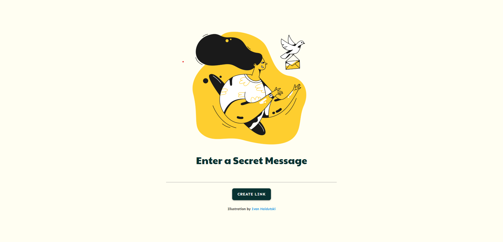
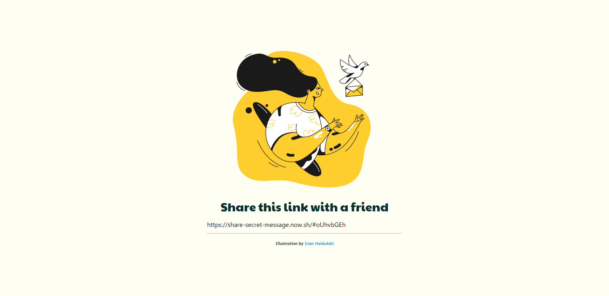

# ✉️ Secret Message Sharing App ✉️

¡Comparte mensajes secretos con tus amigos! Para verlo pincha [aquí](https://share-secret-message.now.sh/)

**_Paso 1:_** _Introduce el mensaje que quieres compartir_

**_Paso 2:_** _Comparte el link generado con tu amigo_

**_Paso 3:_** _¡Ve el mensaje secreto!_

#### Tecnologías

- Vanilla JS (método de *btoa()* y *atob()* para [codificar el mensaje en base-64](https://developer.mozilla.org/es/docs/Web/API/WindowBase64/Base64_codificando_y_decodificando))
- [Materialize CSS](https://materializecss.com/)
- [SCSS](https://sass-lang.com/documentation/syntax)

